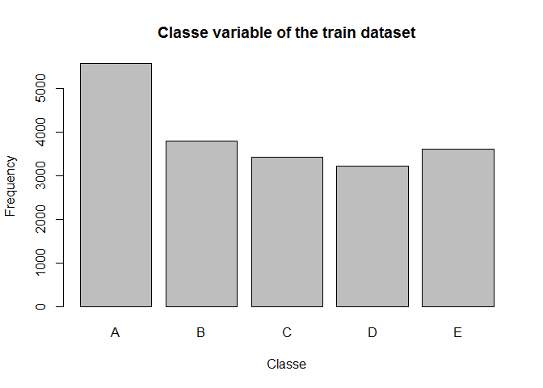

# Practical Machine Learning Course Project
mobini83  
December 23, 2015  
## Introduction   
This project is about using data from accelerometers on the belt, forearm, arm and dumbell of 6 participants. The goal of this project is to predict the manner in which they did the exercise. This report describes how the model is built, how cross validation is used, what the expected out of sample error is, and why the presented choices are made. 

## Data   
The data for this project come from this [source](http://groupware.les.inf.puc-rio.br/har).
The training data are downloadable from [here](https://d396qusza40orc.cloudfront.net/predmachlearn/pml-training.csv) and the test data [here](https://d396qusza40orc.cloudfront.net/predmachlearn/pml-testing.csv). The data sets are downloaded and saved on the lcoal disk, and read into RStudio:  

```r
if (!file.exists("trainDataset.csv")) {
trainDataset <- download.file("https://d396qusza40orc.cloudfront.net/predmachlearn/pml-training.csv", "trainDataset.csv")
}
if(!file.exists("testDataset.csv")){
testDataset <- download.file("https://d396qusza40orc.cloudfront.net/predmachlearn/pml-testing.csv", "testDataset.csv")
}
train <- read.csv("trainDataset.csv", na.strings = c("NA", "#DIV/0!", ""))
test <- read.csv("testDataset.csv", na.strings = c("NA", "#DIV/0!", ""))
```
An initial exloratory analysis of the data is performed to take a look at the dimention of the training data set, and a summary of the class variable which is the the manner in which participants did the exercise.   

```r
dim(train)
```

```
## [1] 19622   160
```

```r
summary(train$classe)
```

```
##    A    B    C    D    E 
## 5580 3797 3422 3216 3607
```

```r
plot(train$classe, main="Classe variable of the train dataset", xlab = "Classe", ylab = "Frequency")
```

 

#### Loading the required libraries and cleaning data   
To prepare the data for the prediction model the columns with non-measurement values, and near zero variables are eliminated. 

```r
library(caret)
library(rpart)
library(randomForest) 
library(parallel)
library(doParallel)
# Eliminating the non-measurement columns 
train <- train[,-c(1:7)]
test <- test[,-c(1:7)]
# Removing the nesr-zero columns 
nearZeroCol <- nearZeroVar(train)
train <- train[,-nearZeroCol]
# Deleting the columns where more than 95% observations are missing
t <- nrow(train)*.95
# extracting the index of columns with less than t missing values
g <- apply(train, 2, function(x){sum(is.na(x))<= t})
# if a variable has more than t missing value, it is eliminated
train <- train[,g]
```
#### Partitioning the data for cross validation    
In order to be able to do the cross validation, the training data is divided into 2 training and validation subsets. 75% of the observations in the `train` dataset are used in the training phase and 25% for the cross validation. For the sake of reproducibility, the seed is set to a constant first. 

```r
set.seed(123)
partition <- createDataPartition(train$classe, p = 0.75, list = FALSE)
trainingSubset <- train[partition, ]
validationSubset <- train[-partition, ]
```
## Model training 
I have used two models for this project: Decision Tree and Random Forest. The two models are compared in the end to choose the best one.   

#### Decision Tree 

```r
DTModel <- rpart(classe ~ ., data = trainingSubset, method = "class")
DTPrediction <- predict(DTModel, validationSubset, type = "class")
confusionMatrix(DTPrediction, validationSubset$classe)
```

```
## Confusion Matrix and Statistics
## 
##           Reference
## Prediction    A    B    C    D    E
##          A 1237  131   16   44   15
##          B   45  598   72   67   71
##          C   39  102  683  134  115
##          D   51   64   65  499   46
##          E   23   54   19   60  654
## 
## Overall Statistics
##                                           
##                Accuracy : 0.7486          
##                  95% CI : (0.7362, 0.7607)
##     No Information Rate : 0.2845          
##     P-Value [Acc > NIR] : < 2.2e-16       
##                                           
##                   Kappa : 0.6817          
##  Mcnemar's Test P-Value : < 2.2e-16       
## 
## Statistics by Class:
## 
##                      Class: A Class: B Class: C Class: D Class: E
## Sensitivity            0.8867   0.6301   0.7988   0.6206   0.7259
## Specificity            0.9413   0.9355   0.9037   0.9449   0.9610
## Pos Pred Value         0.8572   0.7011   0.6365   0.6883   0.8074
## Neg Pred Value         0.9543   0.9134   0.9551   0.9270   0.9397
## Prevalence             0.2845   0.1935   0.1743   0.1639   0.1837
## Detection Rate         0.2522   0.1219   0.1393   0.1018   0.1334
## Detection Prevalence   0.2942   0.1739   0.2188   0.1478   0.1652
## Balanced Accuracy      0.9140   0.7828   0.8513   0.7828   0.8434
```
Cross validation shows an accuracy of 75% for the Decision Tree algotirhm.

#### Random Forest Model

```r
RFModel <- randomForest(classe ~., data = trainingSubset, method = "class") 
RFPrediction <- predict(RFModel, validationSubset, type = "class")
confusionMatrix(RFPrediction, validationSubset$classe)
```

```
## Confusion Matrix and Statistics
## 
##           Reference
## Prediction    A    B    C    D    E
##          A 1394    1    0    0    0
##          B    1  946    7    0    0
##          C    0    2  848    9    0
##          D    0    0    0  794    1
##          E    0    0    0    1  900
## 
## Overall Statistics
##                                           
##                Accuracy : 0.9955          
##                  95% CI : (0.9932, 0.9972)
##     No Information Rate : 0.2845          
##     P-Value [Acc > NIR] : < 2.2e-16       
##                                           
##                   Kappa : 0.9943          
##  Mcnemar's Test P-Value : NA              
## 
## Statistics by Class:
## 
##                      Class: A Class: B Class: C Class: D Class: E
## Sensitivity            0.9993   0.9968   0.9918   0.9876   0.9989
## Specificity            0.9997   0.9980   0.9973   0.9998   0.9998
## Pos Pred Value         0.9993   0.9916   0.9872   0.9987   0.9989
## Neg Pred Value         0.9997   0.9992   0.9983   0.9976   0.9998
## Prevalence             0.2845   0.1935   0.1743   0.1639   0.1837
## Detection Rate         0.2843   0.1929   0.1729   0.1619   0.1835
## Detection Prevalence   0.2845   0.1945   0.1752   0.1621   0.1837
## Balanced Accuracy      0.9995   0.9974   0.9945   0.9937   0.9993
```
Cross valication accuracy for the Random Forest algorithm is 99.5% and the out of sample error (calculated as `1-accuracy`) is about 0.5%, which indicate its excellent performance. 

## Summary 
As shown above the Random Forest algorithm outperforms the Decision Tree algorithm. The Random Forest algorithm gained 0.9955 accuracy with 95% CI of (0.9932, 0.9972), while Decision Tree algorithm resulted in accuracy of 0.75 and 95% CI of (0.7362, 0.7607). The Random Forest algorithm is therefore the chosen one.         
The expected out of sample error is calculated as `1 - accuracy` when the algorithm is applied on the cross validation dataset. The out of sample error was estimated at 0.5%. Accuracy is defined as the number of misclassifications in the validation dataset over the total number of observations. Therefore, the chance of misclassifying in the test dataset when we have out of sample error of 0.5% is very low. 

## Prediction of the test set   
The Random Forest algorithm is applied on the test set and the following results are obtained. 

```r
testSetPrediction <- predict(RFModel, test, type = "class")
testSetPrediction
```

```
##  1  2  3  4  5  6  7  8  9 10 11 12 13 14 15 16 17 18 19 20 
##  B  A  B  A  A  E  D  B  A  A  B  C  B  A  E  E  A  B  B  B 
## Levels: A B C D E
```
#### Writing files for submission 

```r
pml_write_files = function(x){
  n = length(x)
  for(i in 1:n){
    filename = paste0("problem_id_",i,".txt")
    write.table(x[i],file=filename,quote=FALSE,row.names=FALSE,col.names=FALSE)
  }
}

pml_write_files(testSetPrediction)
```


